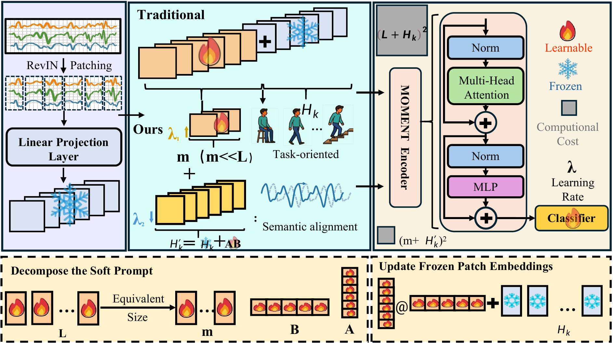
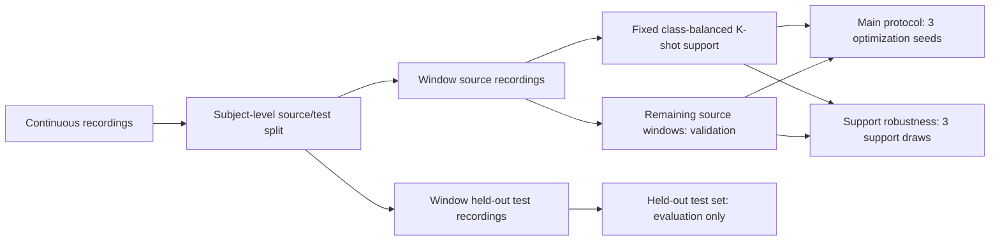
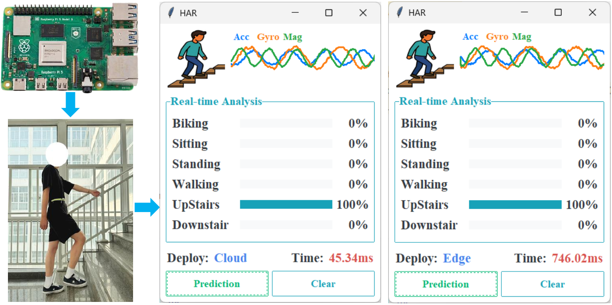

<div align="center">

# DSPT

### Decomposed Sensor Prompt Tuning for Few-Shot Activity Recognition

[](https://github.com/lihenghui612/DSPT/actions/workflows/tests.yml)
[](https://www.python.org/)
[](https://pytorch.org/)
[](LICENSE)

Official implementation of **"Unlocking the Potential of General-Purpose Time Series
Foundation Models via Decomposed Sensor Prompt Tuning for Few-Shot Activity Recognition."**

</div>

<p align="center">
  
</p>

<p align="center"><em>
DSPT separates task guidance from sensor-embedding adaptation while keeping the
general-purpose time series foundation model frozen.
</em></p>

## Highlights

- **Parameter-efficient adaptation:** only the task prompt, low-rank input update,
  and classification head are optimized.
- **Matched input-space budget:** `m=9, r=5` uses 7,488 adaptation parameters,
  compared with 7,680 for Standard Prompt Tuning with `l=15`.
- **Auditable evaluation:** subject-disjoint splitting is completed before windowing;
  support and validation indices are saved in JSON/NumPy manifests.
- **Two uncertainty protocols:** the main results use a fixed support set across
  optimization runs, while a separate analysis varies support-set selection.
- **Cross-domain evaluation:** HHAR utilities cover leave-one-device-model-out and
  leave-one-user-out evaluation.

## Method at a glance

DSPT adapts the frozen MOMENT input embeddings as follows:

| Component | Operation |
| --- | --- |
| Sensor-embedding adaptation | `H' = H + AB`, where `A ∈ R^{s×r}` and `B ∈ R^{r×d}` |
| Task-guidance prompt | `Z = [P ; H']`, where `P ∈ R^{m×d}` |
| Matched-budget constraint | `l·d ≈ m·d + (s+d)·r` |

For MOMENT-SMALL (`d=512`, `patch_len=8`, `seq_len=512`, hence `s=64`),
the paper uses `m=9`, `r=5`, and a Standard PT prompt length of `l=15`.

## Evaluation protocol



The source/test subject partition is fixed for every method. Windowing uses 500
readings with a stride of 250 (50% overlap), and windows crossing an activity
transition are discarded. See [`data/README.md`](data/README.md) for the complete
array interface and protocol.

## Installation

Python 3.10 is recommended.

```bash
git clone https://github.com/lihenghui612/DSPT.git
cd DSPT

python -m venv .venv
source .venv/bin/activate
python -m pip install --upgrade pip
python -m pip install -r requirements.txt
```

Download MOMENT-SMALL separately and save it under `./models`:

```python
from momentfm import MOMENTPipeline

model = MOMENTPipeline.from_pretrained("AutonLab/MOMENT-1-small")
model.save_pretrained("./models")
```

The backbone weights are not redistributed here and remain subject to the original
authors' license.

## Datasets and preprocessing

The raw and processed datasets are intentionally not redistributed. Download the
three public datasets from their official sources:

| Dataset | Official source | Channels | Classes | Subjects |
| --- | --- | ---: | ---: | ---: |
| MotionSense | [Official repository](https://github.com/mmalekzadeh/motion-sense) | 12 | 6 | 24 |
| HHAR | [UCI repository](https://archive.ics.uci.edu/dataset/344/heterogeneity+activity+recognition) | 12 | 6 | 9 |
| PAMAP2 | [UCI repository](https://archive.ics.uci.edu/dataset/231/pamap2+physical+activity+monitoring) | 36 | 12 | 9 |

Convert each dataset into the per-reading interface documented in
[`data/README.md`](data/README.md), then create the subject-disjoint partitions.
For exact reproduction, replace the example identifiers with the fixed held-out
subjects used for your canonical partition:

```bash
python data/build_subject_partitions.py \
  --input_root data/HHAR/continuous \
  --output_root data/HHAR \
  --test_subjects SUBJECT_A SUBJECT_B
```

Generate auditable class-balanced support sets after the source/test partition is
fixed:

```bash
python data/build_splits.py \
  --datasets MotionSense HHAR PAMAP2 \
  --shots 1 5 10 20 \
  --support_seeds 0 1 2
```

This creates paths such as
`data/HHAR/5-shot/support-seed-0/`. The held-out test arrays never change.

## Training and evaluation

### Main fixed-support protocol

Use one class-balanced support set for all three runs and vary only initialization
and optimization randomness:

```bash
python train.py \
  --dataset MotionSense \
  --shot 5-shot \
  --finetune_type dspt \
  --support_seed 0 \
  --seeds 0 1 2
```

For fully supervised evaluation, the complete source set is used in every run:

```bash
python train.py \
  --dataset MotionSense \
  --shot full \
  --finetune_type dspt \
  --seeds 0 1 2
```

JSON outputs contain every run, the mean, and the sample standard deviation
(`ddof=1`). The held-out test set is evaluated once after model selection.

### Support-set sampling robustness

This separate protocol varies support-set selection while holding the initialization
and optimization seed fixed:

```bash
python support_sampling.py \
  --dataset MotionSense \
  --shot 5-shot \
  --finetune_type dspt \
  --support_seeds 0 1 2 \
  --optimization_seed 0
```

### Available adaptation strategies

| CLI value | Method |
| --- | --- |
| `ft_head` | Classification head only |
| `ft_full` | Full backbone fine-tuning |
| `adapter` | Bottleneck adapters |
| `lora` | Low-rank updates to attention projections |
| `std_pt` | Standard Prompt Tuning |
| `dspt` | DSPT: `[P ; H + AB]` |
| `variant_a` | Placement Variant A: `[P + AB ; H]` |
| `variant_b` | Placement Variant B: `[P ; H] + AB` |

Default settings follow the manuscript: 200 epochs, Adam, batch size 8, cosine
learning-rate scheduling, `m=9`, `r=5`, `lambda_1=1e-3` for the task-guidance
prompt, and `lambda_2=1e-4` for the low-rank sensor-embedding matrices. The CLI
uses `--alpha1` and `--alpha2` for these two learning rates.

## Reproducing the experiment families

```bash
# All DSPT data regimes on MotionSense with one fixed support set
for shot in 1-shot 5-shot 10-shot 20-shot; do
  python train.py --dataset MotionSense --shot "$shot" \
    --finetune_type dspt --support_seed 0 --seeds 0 1 2
done
python train.py --dataset MotionSense --shot full \
  --finetune_type dspt --seeds 0 1 2

# All adaptation methods under one regime
for method in ft_head ft_full adapter lora std_pt dspt; do
  python train.py --dataset MotionSense --shot 5-shot \
    --finetune_type "$method" --support_seed 0 --seeds 0 1 2
done
```

## Ablations and analysis

The ablations use the same fixed-support, repeated-optimization protocol:

```bash
python ablation.py --study prompt_len --dataset MotionSense --shot 5-shot --support_seed 0
python ablation.py --study m          --dataset MotionSense --shot 5-shot --support_seed 0
python ablation.py --study lr         --dataset MotionSense --shot 5-shot --support_seed 0
python ablation.py --study placement  --dataset MotionSense --shot 5-shot --support_seed 0

python plot_ablation_curves.py \
  results/ablation/MotionSense_5-shot_m.json \
  results/ablation/MotionSense_5-shot_m.pdf --x m

python efficiency.py --dataset HHAR --batch_size 1 --n_iter 2000 --device cpu
```

To create the t-SNE feature visualization:

```bash
for method in ft_head lora dspt; do
  python train.py --dataset MotionSense --shot 5-shot \
    --finetune_type "$method" --support_seed 0 --seeds 0 --save_ckpt
done

python tsne.py --dataset MotionSense --shot 5-shot \
  --finetune_type ft_head lora dspt --support_seed 0 --seed 0
```

## Cross-domain HHAR evaluation

The repository supports the two protocols reported in the manuscript:

- **Cross-device:** four leave-one-device-model-out folds on the evaluated HHAR subset.
- **Cross-subject:** nine leave-one-user-out folds.

Domain assignment is completed before window generation. Prepare the continuous
HHAR interface described in [`data/README.md`](data/README.md), then run:

```bash
python data/build_group_splits.py --axis device  --shots 5 10 --support_seeds 0 1 2
python data/build_group_splits.py --axis subject --shots 5 10 --support_seeds 0 1 2
```

Each generated fold is a standalone dataset root. For example:

```bash
python train.py \
  --dataset HHAR \
  --data_path data/HHAR/cross-device/fold-0-LG-Nexus-4 \
  --shot 5-shot \
  --finetune_type dspt \
  --support_seed 0 \
  --seeds 0 1 2
```

<p align="center">
  
</p>

<p align="center"><em>
The paper also evaluates real-world Edge and Cloud deployment on a Raspberry Pi 5.
</em></p>

## Repository layout

```text
config.py                         Dataset metadata and default hyperparameters
model.py                          DSPT, PEFT baselines, and MOMENT wrapper
train.py                          Fixed-support training and evaluation
support_sampling.py               Support-set sampling robustness analysis
ablation.py                       Prompt, budget, learning-rate, and placement studies
efficiency.py                     Latency and throughput measurement
plot_ablation_curves.py           Mean curves with measured sample-SD bands
tsne.py                           Feature visualization
data/README.md                    Data interface and evaluation protocol
data/build_subject_partitions.py  Subject split before windowing
data/build_splits.py              Class-balanced support-set construction
data/build_group_splits.py        Cross-device and cross-subject folds
```

## Reproducibility notes

- Dataset-specific raw-file parsers are intentionally kept separate from the stable
  NumPy interface because the datasets have different licenses and directory formats.
- Exact numerical reproduction requires the same channel order, activity mapping,
  filtering rules, fixed subject partition, and support indices used in the paper.
- Every preparation script writes a manifest so these decisions can be audited.
- No dataset, backbone weight, or unpublished result file is redistributed here.

## License

The code is released under the [MIT License](LICENSE). The datasets and MOMENT
backbone remain subject to their respective licenses and terms.

## Citation

If this repository helps your research, please cite the paper. The final BibTeX entry
will be added after publication.
