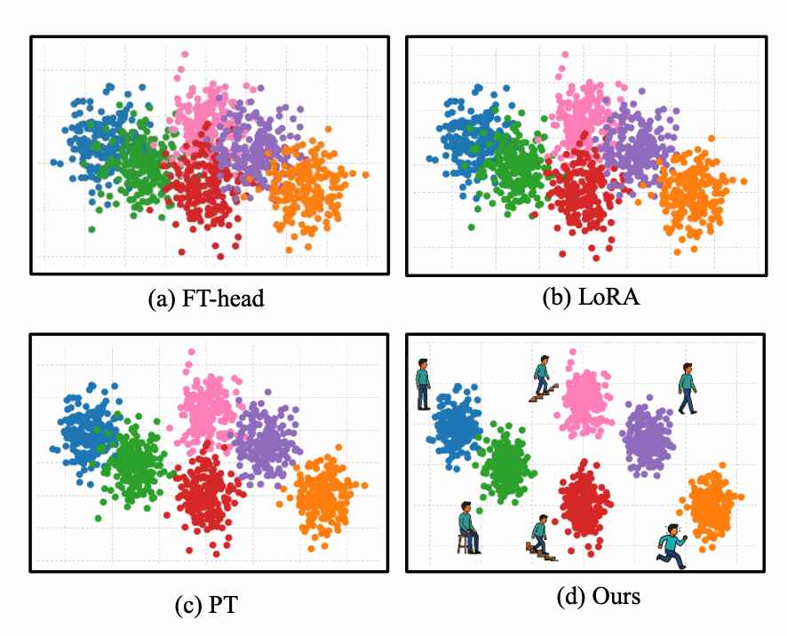
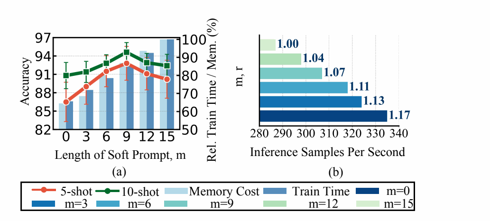

<div align="center">

# DSPT

### Decomposed Sensor Prompt Tuning for Few-Shot Activity Recognition

[](https://github.com/lihenghui612/DSPT/actions/workflows/tests.yml)
[](https://www.python.org/)
[](https://pytorch.org/)
[](LICENSE)

Official implementation of **“Unlocking the Potential of General-Purpose Time Series
Foundation Models via Decomposed Sensor Prompt Tuning for Few-Shot Activity Recognition.”**

[Overview](#overview) · [Results](#key-results) · [Quick Start](#quick-start) ·
[Evaluation Protocol](#evaluation-protocol) · [Cross-Domain Evaluation](#cross-domain-evaluation-on-hhar) ·
[Citation](#citation)

</div>

<p align="center">
  
</p>

<p align="center"><em>
DSPT separates task guidance from sensor-embedding adaptation while keeping the
general-purpose time series foundation model frozen.
</em></p>

## Overview

DSPT is a parameter-efficient approach for adapting a frozen time series foundation
model to few-shot human activity recognition. Instead of using one long prompt for
both task steering and input adaptation, DSPT assigns the two functions to separate,
compact components:

- **Task guidance** is handled by a short trainable soft prompt.
- **Sensor-embedding adaptation** is performed by a low-rank residual update in the
  input space, without reparameterizing the frozen backbone weights.
- **Capacity is allocated deliberately.** With the approximately matched input-space
  budget used in the paper, DSPT uses 7,488 adaptation parameters, compared with
  7,680 for Standard Prompt Tuning.
- **Evaluation is leakage-aware and auditable.** Subject partitioning is completed
  before windowing, and every support/validation selection is saved in a manifest.

The core input transformation is

$$H^{\prime}=H+AB, \qquad Z=[P_s;H^{\prime}],$$

where the compact prompt provides task guidance and the low-rank product adapts the
frozen sensor representations. The paper uses a prompt length of $m=9$ and rank
$r=5$ for DSPT, under a budget approximately matched to Standard PT with $l=15$.

## Key Results

### More discriminative sensor representations

<p align="center">
  
</p>

<p align="center"><em>
Feature distributions on MotionSense in the 5-shot setting. DSPT produces more
compact and clearly separated activity clusters than FT-Head, LoRA, and Standard PT.
</em></p>

### Capacity allocation improves both accuracy and efficiency

<p align="center">
  
</p>

<p align="center"><em>
Performance and efficiency under approximately matched input-adaptation budgets.
The balanced configuration at $m=9$ delivers the best accuracy while reducing
memory and training overhead relative to Standard PT.
</em></p>

### Real-world Edge and Cloud deployment

<p align="center">
  
</p>

<p align="center"><em>
Raspberry Pi 5 deployment with autonomous Edge inference and Cloud-assisted
inference modes.
</em></p>

## Evaluation Protocol

The repository follows the protocol reported in the revised manuscript:

1. **Split before windowing.** Participants are first partitioned into disjoint
   source and test sets, with approximately 80% used as source subjects and the
   remaining subjects reserved for testing.
2. **Generate windows independently.** Each recording is segmented into windows of
   500 readings with a stride of 250. Windows crossing an activity transition are
   discarded.
3. **Construct class-balanced support sets.** For each few-shot setting, exactly
   $K$ labeled windows per class are selected from the source set. The remaining
   source windows form the validation set.
4. **Separate the two uncertainty analyses.** Main results use one fixed support set
   across three initialization and optimization runs. A separate robustness analysis
   varies the support-set selection while holding the optimization seed fixed.

The held-out test subjects never appear in the source, support, or validation sets.
Full array specifications and saved-manifest formats are documented in the
[data preparation guide](data/README.md).

## Datasets

The raw datasets are not redistributed. Please download them from their official
sources and convert them to the NumPy interface described in the data preparation
guide.

- **MotionSense** — 24 subjects, 6 activities, 12 channels.
  [Official repository](https://github.com/mmalekzadeh/motion-sense)
- **HHAR** — 9 subjects, 6 activities, 12 channels.
  [UCI repository](https://archive.ics.uci.edu/dataset/344/heterogeneity+activity+recognition)
- **PAMAP2** — 9 subjects, 12 activities, 36 channels.
  [UCI repository](https://archive.ics.uci.edu/dataset/231/pamap2+physical+activity+monitoring)

## Quick Start

The commands are kept in collapsible sections so the project overview remains easy
to scan. Python 3.10 and PyTorch 2.1 are recommended.

<details>
<summary><strong>1. Install the environment and MOMENT-SMALL</strong></summary>

```bash
git clone https://github.com/lihenghui612/DSPT.git
cd DSPT

python -m venv .venv
source .venv/bin/activate
python -m pip install --upgrade pip
python -m pip install -r requirements.txt
```

```python
from momentfm import MOMENTPipeline

model = MOMENTPipeline.from_pretrained("AutonLab/MOMENT-1-small")
model.save_pretrained("./models")
```

The backbone weights are downloaded separately and remain subject to the original
MOMENT license.

</details>

<details>
<summary><strong>2. Prepare a subject-disjoint dataset and support sets</strong></summary>

Replace the example subject identifiers with those used for the intended partition.

```bash
python data/build_subject_partitions.py \
  --input_root data/HHAR/continuous \
  --output_root data/HHAR \
  --test_subjects SUBJECT_A SUBJECT_B

python data/build_splits.py \
  --datasets MotionSense HHAR PAMAP2 \
  --shots 1 5 10 20 \
  --support_seeds 0 1 2
```

</details>

<details>
<summary><strong>3. Run the main fixed-support experiment</strong></summary>

The support set remains fixed while initialization and optimization seeds vary.

```bash
python train.py \
  --dataset MotionSense \
  --shot 5-shot \
  --finetune_type dspt \
  --support_seed 0 \
  --seeds 0 1 2
```

For fully supervised evaluation, use the full source set in every run.

```bash
python train.py \
  --dataset MotionSense \
  --shot full \
  --finetune_type dspt \
  --seeds 0 1 2
```

</details>

<details>
<summary><strong>4. Run support-set robustness and ablation studies</strong></summary>

```bash
python support_sampling.py \
  --dataset MotionSense \
  --shot 5-shot \
  --finetune_type dspt \
  --support_seeds 0 1 2 \
  --optimization_seed 0

python ablation.py --study prompt_len --dataset MotionSense --shot 5-shot --support_seed 0
python ablation.py --study m          --dataset MotionSense --shot 5-shot --support_seed 0
python ablation.py --study lr         --dataset MotionSense --shot 5-shot --support_seed 0
python ablation.py --study placement  --dataset MotionSense --shot 5-shot --support_seed 0
```

</details>

## Reproducing the Paper

- **Main few-shot and full-supervision results:** [train.py](train.py)
- **Support-set sampling robustness:** [support_sampling.py](support_sampling.py)
- **Prompt, allocation, learning-rate, and placement studies:** [ablation.py](ablation.py)
- **Latency, memory, and throughput measurement:** [efficiency.py](efficiency.py)
- **Feature visualization:** [tsne.py](tsne.py)
- **Subject-disjoint preprocessing:** [data/build_subject_partitions.py](data/build_subject_partitions.py)
- **Class-balanced support construction:** [data/build_splits.py](data/build_splits.py)
- **Cross-device and cross-subject folds:** [data/build_group_splits.py](data/build_group_splits.py)

The implementation includes FT-Head, Full Fine-Tuning, Adapter, LoRA, Standard PT,
DSPT, and the two low-rank placement variants used in the paper. Default training
settings follow the manuscript: 200 epochs, Adam optimization, batch size 8, cosine
learning-rate scheduling, and separate learning rates for the task-guidance prompt
and low-rank sensor-embedding matrices.

## Cross-Domain Evaluation on HHAR

The cross-domain experiments isolate two complementary sources of distribution
shift:

- **Cross-device evaluation:** four leave-one-device-model-out folds.
- **Cross-subject evaluation:** nine leave-one-user-out folds.

Device or subject assignment is completed before window generation, and validation
data are drawn only from the source domains. Each generated fold can be passed
directly to the training script as an independent dataset root. Preparation details
and example commands are available in the
[cross-domain data guide](data/README.md#cross-domain-hhar-evaluation).

## Reproducibility Notes

- Every preprocessing utility writes a manifest containing the partition and support
  indices used for the experiment.
- Main-result standard deviations reflect initialization and optimization variability,
  not support-set selection.
- Support-set sampling variability is evaluated separately with shared support indices
  across methods.
- Exact numerical reproduction requires the same channel order, activity mapping,
  filtering rules, subject partition, and support indices used in the paper.
- No dataset, backbone weight, or unpublished result file is redistributed here.

## Citation

If this repository helps your research, please cite the paper. Citation metadata is
provided in [CITATION.cff](CITATION.cff); the final bibliographic entry will be added
after publication.

## License

The code is released under the [MIT License](LICENSE). The datasets and MOMENT
backbone remain subject to their respective licenses and terms.
